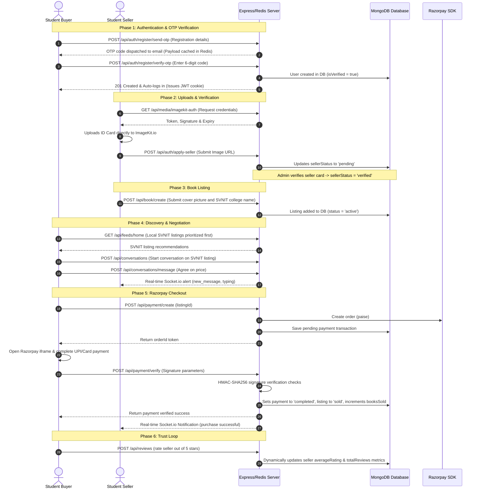

# PustakMart Server Backend

PustakMart is a verified student-to-student academic resource marketplace focused on local discovery, trust, and affordability. This directory houses the Express.js, MongoDB/Mongoose, Redis, and Socket.io real-time backend.

---

## Tech Stack & Core Libraries

- **Runtime**: Node.js (ES Modules)
- **Framework**: Express.js
- **Database**: MongoDB & Mongoose ODM
- **Caching & OTP Session Store**: Redis (`ioredis`)
- **Real-time Communication**: Socket.io
- **Media Uploads**: ImageKit.io Node SDK (`@imagekit/nodejs`)
- **Payment Processing**: Razorpay Gateway Node SDK (`razorpay`)
- **Email Senders**: Nodemailer with Gmail API (Google OAuth2 Client Credentials & Refresh Token)
- **Security & Headers**: Helmet, CORS, and Express-Rate-Limit
- **Validation**: Express-Validator

---

## Getting Started

### 1. Installation
Install all backend dependencies:
```bash
npm install
```

### 2. Environment Configurations
Create a `.env` file in this directory with the following variables:
```env
PORT=3000
MONGO_URL=your_mongodb_connection_string
JWT_SECRET_KEY=your_jwt_signing_secret_key

# ImageKit credentials
IMAGEKIT_PUBLIC_KEY=your_imagekit_public_key
IMAGEKIT_PRIVATE_KEY=your_imagekit_private_key
IMAGEKIT_URL_ENDPOINT=your_imagekit_url_endpoint

# Razorpay credentials
RAZORPAY_KEY_ID=your_razorpay_key_id
RAZORPAY_KEY_SECRET=your_razorpay_key_secret

# Gmail API OAuth2 credentials for Nodemailer
CLIENT_ID=your_google_oauth2_client_id
CLIENT_SECRET=your_google_oauth2_client_secret
REFRESH_TOKEN=your_google_oauth2_refresh_token
EMAIL_USER=your_gmail_address

# Redis cache credentials
REDIS_HOST=your_redis_host
REDIS_PORT=your_redis_port
REDIS_PASSWORD=your_redis_password

# Security Origins
ALLOWED_CLIENT_ORIGIN=http://localhost:5173
```

### 3. Run Development Server
```bash
npm run dev
```

### 4. Run Automated Verification Tests
Verify all API endpoints, Razorpay orders, image uploads, Redis caching, and verification cycles using our test runners:
```bash
# Verify payment flows
node test_payment.js

# Verify email dispatching
node test_email.js

# Verify Redis set/get
node test_redis.js

# Verify OTP Registration and Password Recovery flows
node test_otp_flow.js
```

---

## API & Controller Contracts

All endpoints return a standardized JSON envelope:
```json
{
  "success": true,
  "message": "Description text",
  "data": {}
}
```

### 1. Authentication & Recovery (`/api/auth`)

These routes are backed by Redis session management to avoid database pollution with unverified junk accounts.

- `POST /register/send-otp`: Validates user inputs, checks if email/mobile is unique in DB, hashes the password, stores registration payload in Redis (`register-data:${email}` for 5 mins), and sends a 6-digit OTP code to the email (2-min cooldown).
- `POST /register/verify-otp`: Validates the OTP. If correct, retrieves the payload from Redis and creates the user in MongoDB with `isVerified: true`, clears keys, issues a JWT token, and auto-logs the user in.
- `POST /register/resend-otp`: Overwrites previous OTP with a new code in Redis, resets attempts, and triggers an email dispatch (respects the 2-min cooldown and 5-send hourly limit).
- `POST /forgot-password/send-otp`: Checks if email exists in DB, generates recovery OTP, and sends reset code.
- `POST /forgot-password/verify-otp`: Verifies OTP. On match, creates a 10-minute reset session token (`reset-session:${email}`) in Redis and returns it to the client.
- `POST /reset-password`: Validates the reset token from Redis and updates the user's password in MongoDB.
- `POST /login`: Validates credentials, checks email verification status (`isVerified === true`), checks block/deleted status, signs JWT cookie, and updates login logs.
- `POST /logout` *(Private)*: Clear cookie and add token to blacklist.
- `GET /me` *(Private)*: Fetch logged-in user profile.
- `PUT /profile` *(Private)*: Update customizable profile details.
- `POST /apply-seller` *(Private)*: Submit college ID card URL for seller verification.
- `GET /profile/:id`: Public seller profiles card metadata lookup.

### 2. Book Listings (`/api/book`)
- `POST /create` *(Private)*: Publish listing (supports single `book` or semester `bundle` of books).
- `GET /`: Search listings with **Local First** prioritizations (user college matches appear first).
- `GET /:id`: View book metadata. Auto-increments views count for guest/non-owner views.
- `PUT /:id` *(Private)*: Edit listing information.
- `DELETE /:id` *(Private)*: Soft-delete listing; changes status to `removed`.
- `POST /:id/sold` *(Private)*: Set listing as sold manually and auto-increment seller's `booksSold` stat.

### 3. Book Requests (`/api/requests`)
- `POST /` *(Private)*: Submit needed book title, branch, semester, and budget.
- `GET /`: Search open requests (same-college requests first).
- `PUT /:id` *(Private)*: Edit request details or mark status as `fulfilled`.
- `DELETE /:id` *(Private)*: Remove request from system.

### 4. Razorpay Payments (`/api/payment`)
- `POST /create` *(Private)*: Creates a Razorpay order in paise, logs a pending payment record, and returns the order details for the frontend checkout overlay.
- `POST /verify` *(Private)*: Cryptographically verifies the signature (`razorpay_payment_id`, `razorpay_order_id`, `razorpay_signature`) using HMAC-SHA256. If valid:
  - Changes database payment state to `completed`.
  - Updates the listing status to `sold`.
  - Increments the seller's `booksSold` profile count.
  - Broadcasts a real-time Socket.io buy alert and creates a notification.

### 5. Sockets & Conversations (`/api/conversations`)
- `POST /` *(Private)*: Establish conversation for a specific listing.
- `GET /` *(Private)*: Retrieve active chat channels with last message preview.
- `POST /message` *(Private)*: Send a message, trigger database notifications, and dispatch Socket.io events.
- `GET /message/:conversationId` *(Private)*: Retrieve messages history and mark incoming threads as read.

### 6. Bookmarks & Reviews
- `POST /api/saved-listings/:listingId` *(Private)*: Save/Unsave listing bookmarks.
- `GET /api/saved-listings` *(Private)*: Fetch bookmarks.
- `POST /api/reviews` *(Private)*: Review a seller. Dynamically re-aggregates seller average ratings.
- `GET /api/reviews/:sellerId`: Fetch feedback lists for a seller.

### 7. Media upload credentials (`/api/media`)
- `GET /imagekit-auth` *(Private)*: Generates token, signature, and expiration params for secure client-side uploads directly to ImageKit.io.

### 8. Moderation Panel (`/api/admin`)
- `GET /analytics` *(Private Admin)*: Fetches database analytics stats.
- `GET /users` / `/listings` / `/reports` *(Private Admin)*: Moderation lookups.
- `PATCH /reports/:id` *(Private Admin)*: Resolve/Dismiss report. Resolving auto-deletes listing.
- `POST /admin/verify-seller/:id` *(Private Admin)*: Verify (approve/reject) a seller verification application.

---

## Real-Time Sockets Event Structures

1. **Client to Server**:
   - `typing`: `{ conversationId, recipientId, isTyping }`
   - `read_receipt`: `{ conversationId, recipientId }`
2. **Server to Client**:
   - `new_message`: `{ conversationId, message: { id, sender, content, createdAt } }`
   - `typing`: `{ conversationId, senderId, isTyping }`
   - `read_receipt`: `{ conversationId, readerId }`
   - `notification`: `{ type, message }`

---

## MERN Phased User Flow

This outline explains how the frontend must consume the APIs to execute student transactions.


